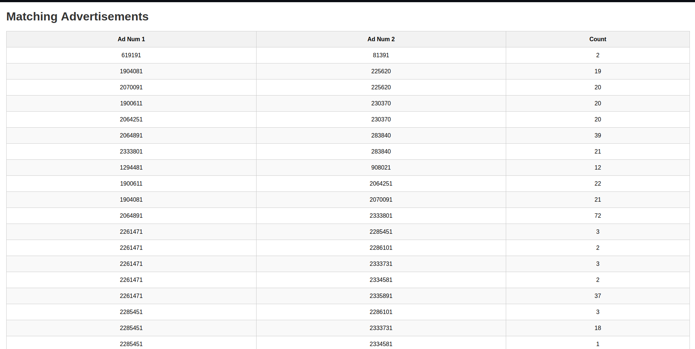

# Registration Number Fraud Detector

## Problem 

Specialized platforms such as Airbnb, Abritel etc, offer furnished tourist rentals. However, all properties offered for short-term rental must be declared to an establishment, with the exception of mobility leases. The establishment issues a unique registration number for each declared rental, which must be displayed on all rental advertisements.

It is possible that some people, whether agencies or individuals, illegally use the registration numbers of other properties already declared to put up undeclared rentals. This practice enables them to avoid paying taxes or complying with other legal obligations.

## Solution 

The solution is to compare the pictures of all advertisements that they have the same registration number, if they are the same pictures sot hey are note try to fraud if not they are.

I used the pre-trained model named `Xception` on `imagenet` dataset and used it to extract features from the images.Then, I stored those features. Using cosine similarity I was a able to find images similar to it so first I passed the image through the model to extract its features and then the features extracted from the other images are matched using a similarity metric in our case cosine similarity.

I then made a simple flask app that uses the results from the dataset to allow us to use the registration number and then find if there are any matching advertisement numbers in this registration numbers.

  

Currently under work
